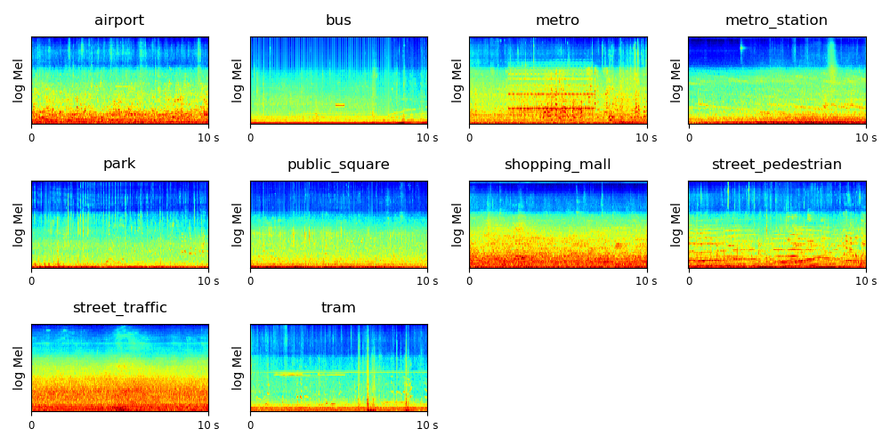

# [Deep mutual attention network for acoustic scene classification](https://www.sciencedirect.com/science/article/pii/S1051200422000677)
👍👍👍🤙🤙🤙

This repository provides the Official PyTorch implementation of **DMA-Net**, from the following paper:

[Deep mutual attention network for acoustic scene classification](https://www.sciencedirect.com/science/article/pii/S1051200422000677). Digital Signal Processing, 2022.\
[Wei Xie](https://chester-w-xie.github.io/), [Qianhua He](https://scholar.google.com/citations?user=xgI45kMAAAAJ&hl=en),
[Zitong Yu](https://sites.google.com/view/zitongyu), [Yanxiong Li](https://scholar.google.com/citations?user=ywDuJjEAAAAJ&hl=en)

South China University of Technology, Guangzhou, China


<p align="center">

</p>
<p align="center">
  Figure 1: Schematic diagram of the proposed deep mutual attention network.
</p>


For the sake of simplicity, this repository provides instructions on processing the DCASE2018-1a dataset using both PyTorch and MATLAB. However, it can easily be adapted for processing other datasets by making changes solely to the dataset path and label information.


## DATASET

The dataset is downloadable from http://dcase.community/challenge2018/task-acoustic-scene-classification

The dataset contains 10 classes of audio scenes, recorded with Device A, B and C. The statistic of the data is shown below:

|           |         Attributes        |                    Dev.                    | Test |
|:---------:|:-------------------------:|:------------------------------------------:|:----:|
| Subtask A | Binanural, 48 kHz, 24 bit |               Device A: 8640               | 1200 |
| Subtask B |       Mono, 44.1 kHz      | Device A: 8640 Device B: 720 Device C: 720 | 2400 |
| Subtask C |             -             |                  Any data                  | 1200 |

The log mel spectrogram of the scenes are shown below:




## Requirements

[Conda]( https://conda.io/projects/conda/en/latest/user-guide/install/index.html?highlight=conda ) should be installed on the system.

* Install [Anaconda](https://www.anaconda.com/) or conda

* Run the install dependencies script:
```bash
conda env create -f environment.yml
```
This creates conda environment ```DCASE``` with all the dependencies.


## Time-frequency features (TFFs) extraction 

Please follow the instructions in [here](https://github.com/chester-w-xie/DMA-Net/tree/main/TFFs%20extraction%20using%20Matlab) to prepare the TFFs of all the audio files.


## Integrate multiple feature files.

```
python matlab_feature_conversion.py --project_dir path to DMA-Net

```

## Test the data loading function and normalize the features.

```
python DatasetsManager.py --project_dir path to DMA-Net

```


## Citation
If you find this repository helpful, please consider citing:
```
@article{xie2022deep,
  title={Deep mutual attention network for acoustic scene classification},
  author={Xie, Wei and He, Qianhua and Yu, Zitong and Li, Yanxiong},
  journal={Digital Signal Processing},
  volume={123},
  pages={103450},
  year={2022},
  publisher={Elsevier}
}
```
