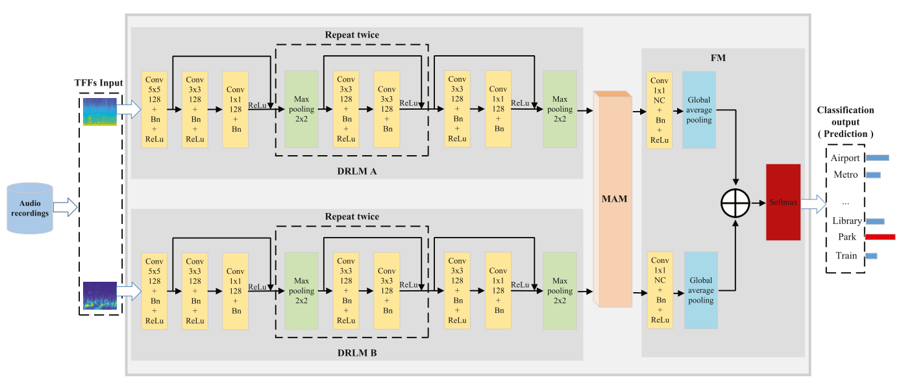

# [Deep mutual attention network for acoustic scene classification](https://www.sciencedirect.com/science/article/pii/S1051200422000677)
👍👍👍🤙🤙🤙

This repository provides the Official PyTorch implementation of **DMA-Net**, from the following paper:

[Deep mutual attention network for acoustic scene classification](https://www.sciencedirect.com/science/article/pii/S1051200422000677). Digital Signal Processing, 2022.\
[Wei Xie](https://chester-w-xie.github.io/), [Qianhua He](https://scholar.google.com/citations?user=xgI45kMAAAAJ&hl=en),
[Zitong Yu](https://sites.google.com/view/zitongyu), [Yanxiong Li](https://scholar.google.com/citations?user=ywDuJjEAAAAJ&hl=en)

South China University of Technology, Guangzhou, China

