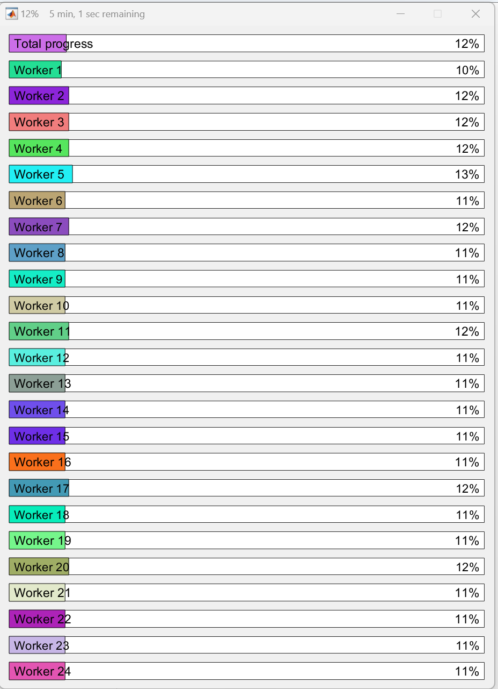

The sub-repo contains the Matlab code for TFFs extraction for the paper "Deep mutual attention network for acoustic scene classification" (DSP 2022)

I have explored several Python libraries for audio feature extraction. However, upon comparison, I've found that the MATLAB Signal Processing Toolbox stands out in its ability to effectively analyze and process audio signals. Consequently, in this project, I choose to use MATLAB for extracting the TFFs (Time-Frequency Features) of audio signals. The code was tested on MATLAB 2022b running on the Windows 10 system. The extracted TFFs are then transmitted to the server for subsequent training.

While this scheme proves to be effective, it does introduce some inconvenience. I am hopeful that future developments will bring about enhanced integration and optimization for a smoother workflow.

1. Download the dataset and place it in the '/TFFs extraction using Matlab/data' directory. Then unzip the file.
2. Execute feature extraction by running the 'TFFs_extraction_Main.m' file. Feel free to modify the parameters in the file to obtain various features.
3. The time required for the feature extraction process is contingent upon the number of CPU cores. The extracted results will be stored in the "Results" folder.
4. Transfer the feature files to the 'DMA-Net/TFFs' directory.

  Feature extraction process based on CPU parallelism.

Done.
